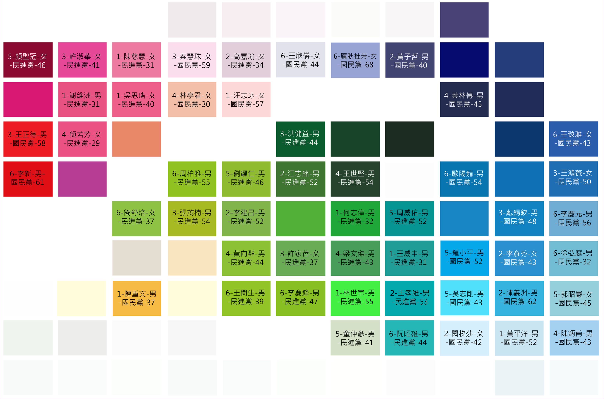

政治色彩學分析—以2014台北市議員競選為例
=======

本分析為 [DSP](http://dsp.im) 所發起的mini project，並刊載於 [50 天 50 張選舉圖表](https://www.facebook.com/50d50v)。

## 目的：
觀察台北市議員候選人是如何用顏色進行的市場定位、打選戰

## 設計作法
收集候選人的文宣照片，並萃取出主要用色，並將主色排序來做呈現
顏色萃取演算法概述如下：  
1. 扣除黑色（頭髮眼睛）和膚色  
2. 將照片所用顏色簡化成 3 ~ 8 群  
3. 從簡化的幾種顏色中選出頻率最高者  
4. 若選出為白色(背景色)則改選頻率次高者  

## 樣本
- 2014年台北市議員
  - 候選人數（共 103 人）
  - 應選人數（共 62 人）
- 收集51份候選人文宣
  - 國民黨24人
  - 民進黨27人

## 發現成果
- 女性候選人大多採用粉紅色系(有一位用粉紅色的男性outlier)
- 樣本中有四位民進黨候選人採用了與無黨籍臺北市長候選人柯文哲相同的藍綠色(Tiffany blue)
- 用色的深淺(深藍、深綠、淺藍、淺綠)與候選人的得票率將會是日後感興趣的研究目標

Contributors: Johnson, CK, Rafe and Crystal
原始資料: candidate.csv  
分析程式: extract-main-colors.R, adjust-colors.R  
原始碼：gpl v2; 視覺呈現: CC-BY-NC 4.0  